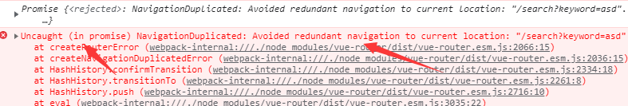

# 1 要求
区分props父子(兄弟也可以)组件通信 和 html与vue数据绑定
    单向数据绑定：<input type="text" :value="name"><br/>，绑定的是在html元素中
    props父子组件通信：<Student :age="18" name="李四" sex="女"/>  
    age前不加：会导致vue认为"18"这个是字符串，加上：才会让vue认为""里面的东西是表达式，可以进行动态运算
    数据绑定是在组件中
## 1.1

每一天老师书写代码务必三遍

## 1.2

node + webpack + VScode + 谷歌浏览器 + git

## 1.3

数组的方法 + promise + await + async + 模块化........

# 2 脚手架使用

1. vue create 项目名称
2. 脚手架目录: public + assets文件夹区别  
   2.1 node_modules: 放置项目依赖的地方  
   2.2 public: 一般放置一些共用的静态资源，打包上线的时候，public文件夹里面资源原封不动打包到dist文件夹里面  
   2.3 src：程序员源代码文件夹  
   2.3.1 -----assets文件夹：经常放置一些静态资源（图片），所有组件共用的静态资源（图片）。assets文件夹里面资源webpack会进行打包为一个模块（js文件夹里面）  
   2.3.2 -----components文件夹:一般放置非路由组件（或者项目共用的组件）  
   App.vue 唯一的根组件  
   main.js 入口文件【程序最先执行的文件】  
   babel.config.js:babel配置文件  
   package.json：看到项目描述、项目依赖、项目运行指令  
   README.md:项目说明文件

# 3 脚手架下载下来的项目稍微配置一下

## 3.1 浏览器自动打开

        在package.json文件中
        "scripts": {
         "serve": "vue-cli-service serve --open",
          "build": "vue-cli-service build",
          "lint": "vue-cli-service lint"
        },

## 3.2 关闭eslint校验工具

创建vue.config.js文件：需要对外暴露 module.exports = { lintOnSave:false, }

## 3.3 src文件夹的别名的设置

因为项目大的时候src（源代码文件夹）：里面目录会很多，找文件不方便，设置src文件夹的别名的好处，找文件会方便一些 创建jsconfig.json文件

```
{
    "compilerOptions": {
        "baseUrl": "./",
        "paths": {
            "@/*": [
                "src/*"
            ]
        }
    },
    "exclude": [//在node_module和disk里不能使用
        "node_modules",
        "dist"
    ]
}
```

# 4 目上传GIT

微信小程序实战课的时候，会带着大家玩耍的 注意:前面基础课程当中，创建分支、处理冲突等等
https://gitee.com/jch1011/shangpinhui_0607.git

# 5 路由的配置

## 5.0 路由的概念

vue-router:路由可以看作是键值对(K-V)  
后端路由:
K即为URL地址 V即为相应的中间件
http://localhost:8080/0607

```js
app.get("/0607", (res, req) => {
    res.send('我是祖国的老花骨朵');
});
```

前端路由:
K即为URL（网络资源定位符） V即为相应的路由组件

## 5.1 路由的一个分析

确定项目结构顺序:上中下 -----只有中间部分的V在发生变化，中间部分应该使用的是路由组件 2个非路由组件|四个路由组件 两个非路由组件：Header 、Footer 路由组件:
Home、Search、Login（没有底部的Footer组件，带有二维码的）、Register（没有底部的Footer组件，带二维码的）

## 5.2 安装路由

cnpm install --save vue-router --save:可以让你安装的依赖，在package.json文件当中进行记录

## 5.3 路由组件地搭建

路由组件一共有四个：Home, Search, Login, Register -components文件夹：放置非路由组件（共用全局组件） -pages|views文件夹：放置路由组件

## 5.4 配置路由，配置完四个路由组件

## 5.5 创建非路由组件（2个：Header、Footer）

非路由组件使用分为几步:
第一步：定义 第二步：引入 第三步：注册 第四步:使用 非路由组件的结构的搭建： 前台项目的结构与样式不需要自己写的，老师准备好了 辉洪老师静态页面： 结构 + 样式 +图片资源 注：

1. 项目采用的less样式,浏览器不识别less语法，需要一些loader进行处理，把less语法转换为CSS语法
2. 安装less less-loader@5 切记less-loader安装5版本的，不要安装在最新版本，安装最新版本less-loader会报错，报的错误setOption函数未定义
3. 需要在style标签的身上加上lang="less",不添加样式不生效

## 5.6 总结

路由组件和非路由组件的区别：

1. 路由组件一般放置在pages|views文件夹，非路由组件一般放置在components文件夹中
2. 路由组件一般需要在router文件夹中进行注册（使用的时候和VueRouter在一起使用，使用<router-view>进行展示） 非路由组件使用的时候是以标签的形式进行使用，如<Header></Header>
3. 注册完路由，不管是路由组件还是非路由组件身上都有$route、$router属性 $route:一般获取路由信息，[路径、query、params等等]
   $router:一般进行编程式导航进行路由跳转【push|replace】

# 6 路由的跳转

路由的跳转就两种形式：声明式导航（router-link：相当于<a></a>标签，务必要有to属性） 编程式导航push||replace 声明式导航能做的编程式导航都能做 编程式导航除了进行路由跳转，还可以做一些其他的业务逻辑

## 6.1 Footer组件的显示与跳转

显示或者隐藏组件：v-if|v—show 要求：在Home、Search显示Footer组件，在Login、Register中隐藏Footer组件
方法一：我们可以根据组件身上的$route获取当前路由的信息，通过路由路径判断Footer显示与隐藏 方法二：配置路由的时候，可以给路由添加路由元信息（meta），meta是个对象，以key-value的形式自定义参数
面试题：v-show与v-if区别? v-show:通过样式display控制 v-if：通过元素上树与下树进行操作

# 7 路由跳转传参，参数有几种写法？

路由跳转传参：当进行路由跳转的时候，把参数传递给要跳转的路由组件， params参数：属于路径中的一部分，需要注意，在配置路由的时候，需要占位，属于URL当中一部分
query参数：不属于路径中的一部分，/home?k=v&kv=，不需要占位 路由跳转传递参数相关面试题 1:路由传递参数（对象写法）path是否可以结合params参数一起使用?
path不能与params一起使用，这样会造成url路径的混乱 2:如何指定params参数可传可不传? 如果路由要求必须传递params参数，但是你就是不传params参数，则会导致url路径有问题
解决：在配置路由的时候，在占位后面加一个?,则这样params就可以传或者不传 3:params参数可以传递也可以不传递，但是如果传递是空串，如何解决？
使用undefined：在params可以传或者不传的情况下，空的字符串可以使用undefined去定义 如果指定name与params配置, 但params中数据是一个"", 无法跳转，路径会出问题 4:
路由组件能不能传递props数据? 能，但一般用的比较少 使用时机：配置路由信息的时候就已经知道要传递的参数值是多少，直接接在index.js里配置路由信息时传入props配置项
使用目的：方便书写，params写法：{{$route.params.keyword}}，props写法:
{{keyword}} 5: 多次执行相同的 push 问题 多次执行相同的 push 问题，控制台会出现警告 例如：使用 this.$router.push({name:‘Search’,params:{keyword:"…"
||undefined}})时，如果多次执行相同的 push，控制台会出现警告。

原因：push 是一个 promise，promise 需要传递成功和失败两个参数，我们的 push 中没有传递。 方法：this.$router.push({name:‘Search’,params:{keyword:"…"
||undefined}},()=>{},()=>{})后面两项分别代表执行成功和失败的回调函数。 这种写法治标不治本，将来在别的组件中 push|replace,编程式导航还是会有类似错误 push 是
VueRouter.prototype 的一个方法，在 router 中的 index 重写该方法即可

```js
    //1、先把VueRouter原型对象的push，保存一份
let originPush = VueRouter.prototype.push;
//2、重写push|replace
//第一个参数：告诉原来的push，跳转的目标位置和传递了哪些参数
VueRouter.prototype.push = function (location, resolve, reject) {
    if (resolve && reject) {
        originPush.call(this, location, resolve, reject);
    } else {
        originPush.call(
            this,
            location,
            () => {
            },
            () => {
            }
        );
    }
};
   ```

# 8 三级联动

由于三级联动，在Home，search，detail中都有，因此把三级联动注册为全局组件（在main.js里注册）。 好处：只需要注册一次，就可以在项目的任意地方使用

## 8.1 组件拆分

Html + Css + 图片资源(修改图片的路径)

## 8.2 Postman测试接口

如果服务器返回的数据code字段是200，代表服务器返回数据成功 整个项目，接口前缀都有/api字样

# 9 axios二次封装

## 9.1 为什么需要二次封装axios？

请求拦截器，响应拦截器 请求拦截器：可以在发请求之前处理一些业务。 响应拦截器：可以在服务器返回数据后，处理一些事情。

## 9.2

安装axios：npm i --save axios 一般将axios请求放在src下面的自定义文件夹api中

# 10 接口统一管理

项目很小：在组件的生命周期函数中发送请求 项目很大：axios.get('xxx)
问题：假如有100个组件都有请求，如果请求的接口地址发生变化，就得一个个组件的去寻找修改 解决：在api文件夹下创建index.js文件

## 10.1 跨域问题

跨域：协议、域名、端口号不同的请求 前端项目本地服务器：http://localhost:8080/#/home  
后台服务器：http://39.98.123.211
解决方案：JSON、CROS和proxy代理（即在vue.config.js里面设置代理服务器）

```js
//代理跨域
devServer: {
    //只有浏览器与服务器之间才会有跨域问题，服务器与服务器之间是没有跨域问题的
    //所以在这里设置了一个代理服务器用与和目标服务器进行交互
    proxy: {
        //若请求路径中有/api，代理服务器就会去寻找target里的服务器
        '/api':{
            target: 'http://39.98.123.211'
            // pathRewrite: { '^/api': '' },
        }
    }
}
```

## 10.2 nprogress进度条使用

用于显示请求的进度 start:进度条开始 done：进度条结束

# 11 vuex

用于多组件之间共享数据 构成：store{state:{}, actions:{}, mutations:{}, getters:{}}

# 12

## 12.1 完成一级分类 动态 添加背景颜色

方法一：采用css样式完成 方法二：通过js完成：事件委派|时间代理 鼠标放上：@mouseenter 例：@mouseenter="changeIndex(index)
鼠标离开：@mouseleave 例：@mouseleave="leaveIndex"
动态类别: :class="{类名:js的boolen表达式}" 例：:class="{cur:currentIndex==index}"

## 12.2 通过js控制二三级商品分类的显示与隐藏

最开始的时候，是通过CSS样式display：block|none显示与隐藏商品的二三级分类 动态样式：:style="{属性名:js表达式}" 例：:style="{display:
currentIndex==index?'block':'none'}"

# 13 三级联动 演示的卡顿现象

正常：事件触发非常频繁，而且每一次的触发，回调函数都要执行（如果时间很短，而且回调函数内部有计算，那么很有可能出现浏览器卡顿）

## 13.1 函数的防抖与节流

防抖：前面所有的触发都取消，最后一次执行在规定的时间之后才会触发，也就是说如果连续快速地触发，只会执行一次 防抖：用户操作很频繁，但是只是执行一次
节流：在规定的时间间隔内不会重复触发回调，只有大于这个时间间隔才会触发回调，把频繁触发变为少量触发 节流：用户操作很频繁，但是把频繁的操作变为少量的操作（在规定的时间内只能执行一次）

# 14 开发search模块中的typeNav商品分类菜单（过渡）

过渡动画：前提组件|元素必须要有v-if|v-show指令才可以进行过渡动画

# 15 对商品分类

# 16 合并params和query参数

动机：我们需要这样一个场景：两处跳转搜索页的地方（先点击三级联动再输入文字点击搜索框、先输入文字点击搜索框再点击三级联动），都需要判断有无另一种参数，并合并 正确写法：

1. 在三级联动typeNav里：

```js
      let location = {name: 'search'}
let query = {categoryName: categoryname}
//判断：如果进行路由跳转的时候，带有params参数，也要传过去
if (this.$route.params) {
    location.params = this.$route.params
}
//整理完参数:将location和query两个对象进行合并
location.query = query
this.$router.push(location)
```

2. 在Header里：

```js
      let location = {
    //若使用params参数，必须使用name属性，不能使用path属性
    name: "search",
    params: {
        keyword: this.keyword
    }
}
if (this.$route.query) {
    location.query = this.$route.query;
}
this.$router.push(location)
```

3. 错误写法：不能直接把query参数的键自定义为一个值（如k），因为在先前的路由地址已经携带了query参数键值对（categoryName等等），这样做会造成路由地址无法正常显示（乱码）

```js
      this.$router.push({
    name: "search",
    params: {
        keyword: this.keyword
    },
    query: {
        k: this.$route.query
    }
})
```

# 17 开发Home首页中的 ListContainer 组件与 Floor 组件

前提：服务器返回的数据只有商品分类三级菜单的数据，对于ListContainer和Floor组件并有数据 mock数据（模拟）：用于模拟数据，需要用到的插件是mockjs 使用步骤：

1) 在项目中src文件夹中创建mock文件夹
2) 准备json数据（在mock文件夹中创建相应的json文件）-----记得格式化以下，别留有空格，否则项目会跑不起来
3) 把mock数据需要的图片放置到public文件夹中【public文件夹在打包时，会把相应的资源原封不动打包到dist文件夹中】
4) 在mock文件夹中创建的mockServe.js通过mockjs插件实现模拟数据。（webpack默认对外暴露的：图片、json数据格式，因此json文件不用暴露）
5) mockServe.js文件需要在入口文件main.js中引入（至少需要执行一次，才能模拟数据）。

# 18 使用swiper组件来实现轮播图

//第一步：引包 //第二步：页面中html结构一定要有 //第三步：new Swiper实例【轮播图添加动态效果】 解决轮播图问题：watch + $nextTick：数据监听，监听已有数据变化 $nextTick(
经常和插件一起使用，因为需要先确保DOM元素结构的存在): nextTick：在下次DOM更新（指的是服务器返回数据） 循环结束之后（通过v-for生成DOM元素）执行延迟回调。在修改数据之后立即使用这个方法，获取更新后的 DOM。

```js
// 当你执行这个回调的时候，保证服务器数据回来了、v-for执行完毕了（轮播图的结构一定有了）
watch:{
    /*通过watch监听bannerList属性的属性值的变化*/
    bannerList:{
        handler(newValue, oldValue)
        {
            //如果执行handler方法，代表组件实例身上的这个属性的属性值发生了变化（在这里表示从无到有），
            //当前这个函数执行：只能保证bannerList数据已经有了，但是无法保证v-for已经执行了
            //v-for执行完毕，才有结构；而现在在watch当中是没有办法保证的
            //nextTick：在下次DOM更新（指的是服务器返回数据） 循环结束之后（通过v-for生成DOM元素）执行延迟回调。在修改数据之后立即使用这个方法，获取更新后的 DOM。
            this.$nextTick(() => {
                //只有当服务器数据回来了、v-for执行完毕了（轮播图的结构一定有了），才能执行这个回调的时候。
                var mySwiper = new Swiper(this.$refs.mySwiper, {
                    loop: true, // 循环模式选项

                    // 如果需要分页器
                    pagination: {
                        el: ".swiper-pagination",
                        clickable: true,//分液器小球是否能够翻页
                    },

                    // 如果需要前进后退按钮
                    navigation: {
                        nextEl: ".swiper-button-next",
                        prevEl: ".swiper-button-prev",
                    },

                    // 如果需要滚动条
                    scrollbar: {
                        el: ".swiper-scrollbar",
                    },
                });
            })
        }
    }
}
```

# 19 开发floor组件

## 19.1

getFloorList这个action在哪里触发？是需要在Home路由组件中触发。 因为返回的数据是一个包含两个对象的数组，一个对象对应一个Floor组件的数据。
当我们用这个数组通过v-for的生成Floor组件时，就只能从Home组件中生成Floor。

## 19.2

v-for也可以在自定义组件中使用，如：<Floor v-for="(floor, index) in floorList" :key="floor.id"></Floor>

## 19.3

组件通信的方式有哪些？ props：实现父给子通信 自定义事件：@on @emit 实现子给父通信 全局事件总线：$bus 插槽 vuex

## 19.4 把首页中轮播图拆分为一个全局的共用组件

切记：以后在开发项目的时候，如果看到一个组件在很多地方都用过，要把这个组件变为全局组件 要把非路由组件和公用的组件放到components文件夹下 好处：注册一次，可以在全局任意地方使用

# 20 search 模块开发

1. 静态页面+静态组件拆分出来
2. 发请求（API）
3. vuex（三连环）
4. 组件获取仓库数据，动态显示数据

# 21 开发面包屑中
## 动态开发面包屑中的分类名
编程式导航路由跳转（自己跳自己）
## 动态开发面包屑中的关键字
当面包屑中的关键字清除之后，需要让兄弟组件Header中的关键字清除
组件通信的方式有哪些？
props：实现父给子通信
@on @emit：自定义事件，实现子给父通信, 子组件中给相关元素添加@click:"this.$emit('自定义事件名',自定义事件的参数)，然后给父组件中的子组件添加 @自定义事件名=''自定义事件名'
插槽：实现父给子通信
vuex：万能，仓库数据
$bus：万能，全局事件总线

# 22 排序
order的属性值最多有多少种写法？
    1:asc 1:desc 2:asc 2:desc
类名的高亮问题，谁应该有类名？
    通过order属性值中是否包含1（综合）|包含2（价格）
谁应该有箭头？
    谁有类名，谁就有箭头
箭头用什么制作？
    阿里图标库 https://www.iconfont.cn/ 
    把复制好的css样式链接（https://at.alicdn.com/t/font_3207619_sljmcv3qpu.css）放到public文件夹下的index.html中
    动态绑定样式示例：<span v-show="isOne" class="iconfont" :class="{'icon-up':isAsc,'icon-down':isDesc}"></span>
    静态样式class和动态样式:class可以在一起使用，动态样式一般用对象写法，并且类名要加'',类名值(isAsc)为js Boolean表达式，返回ture或者false

# 23 分页器
## 分页功能的实现
为什么很多项目采用分页功能：电视平台同时展示的数据有很多，一次性返回展示会带给服务器很多压力
ElementUI是有相应的分页组件，使用起来超级简单，但是咱们前台项目目前不用【掌握自定义分页功能】
## 分页器展示，需要哪些数据
1. 需要知道当前是第几页：pageNo字段代表当前页数
2. 需要知道每一页需要展示多少条数据: pageSize字段代表
3. 需要知道整个分页器一共有多少条数据：total字段代表
4. 需要知道分页器连续页面的个数：continues：5|7 因为奇数对称好看
## 自定义分页器：
在开发的时候先自己传递假的的数据进行调试，调试成功后再传递服务器数据
## 对于分页器而言：
很重要的是：计算出页面的起始数字和终结数字
当前页是第8页： 6 7 8 9 10
当前页是第15页：13 14 15 16 17
## 分页器动态展示：分为上中下
v-for：数组|数字|字符串|对象

# 24 开发一个产品的详情页
1. 静态组件:首先注册为路由组件/当点击商品的图片的时候，跳转到详情页面，在路由跳转的时候需要带上产品的id给详情页面/解决滚轮问题
2. 发送请求: API--->请求接口
3. vuex：获取产品详情信息 vuex中还需要再新增一个模块detail,并且要回到index.js中进行合并
4. 动态展示组件

# 25 detail详情页
## 数据解释？-------售卖属性
[
    {
        attr:'颜色',
        attrValue:['粉色'，'天蓝色']
    },
    {
        attr：'版本',
        attrValue:['16', '20']
    }
]
## 点击谁谁就高亮：排他思想


# 26 购物车操作
## 1. 加入购物车按钮
1.1 酷游跳转之前发送请求
1.2 成功=>路由跳转和参数传递
浏览器储存功能：html5中新增的，本地存储和会话存储
    本地存储：持久化的，哪怕你关闭浏览器，电脑关机，只要你不删都会有。但是上限是5M
    绘画存储：非持久化的，会话结束就消失
1.3 失败=>提示失败信息

## 2. addCartSuccess中跳转其他组件
2.1 查看详情
2.2 查看购物车

## 3. 购物车
3.1 购物车静态组件-需要修改样式结构
    调整css让各个项目对齐，删除第三项 15 35 10 17 13 
3.2 向服务器发送请求，获取购物车数据，操作vuex三连环、组件获取数据
    问题：发送请求的时候，获取不到你购物车里面的数据，因为服务器不知道你是谁？
    解决：在点击加入购物车按钮时，应该向服务器发送你的id
3.3 UUID临时游客身份
3.4 动态展示购物车数据
3.5 修改购物车产品的数量（需要发送请求，参数理解）
    a标签的触发关键字是@click，即点击的时候进行触发事件：<a @click="事件名">
    input标签的触发关键字是@change，即当input的表单元素发生变化的时候及性能触发事件：<input type="text" @change="事件名">
    ## 修改产品数量时要节
3.6 删除某一个产品

3.7 删除全部产品的操作
没有删除全部产品的接口，但是有通过ID一次删除一个产品的接口。
Promise.all([p1,p2,p3])
p1|p2|p3:每一个都是Promise对象，如果有一个Promise失败，都失败，如果都成功，则返回成功


# 27 登录与注册静态组件-（处理公用图片资源问题）
登录与注册功能（git）：必须要回的技能
## 1 登录与注册地静态组件
    assets文件夹---放置全部组件的共用静态资源
    在css样式当中也可以使用@（src的别名），切记在前面加上~
## 2 注册的业务
    注册业务|登录业务表单验证先不处理【最后一天统一处理】
    获取验证码的接口 /api/user/passport/sendCode/{phone}    get请求
## 3 登录业务
    注册：通过数据库储存用户信息（名字，密码）
    登录：登录成功的时候，后台为了区分你这个用户是谁，服务器下发了token（令牌：唯一标识） 
    提前解释一下为什么要使用老师的账号(137.......)登陆，因为里面有收件人信息列表
    登录手机号：18944444444 登录密码：123 或者 13700000000 111111
## 4 登录过后首页用户信息提示   
    1. 登陆成功后获取到token储存到vuex中，随后路由跳转到home首页，home获取到vuex中的用户信息进行动态展示
    2. 但是一刷新home首页，获取不到用户信息（token，name等，因为vuex是非持久化存储）
    3. 解决：持久化储存数据,localStorage.setItem localStorage.getItem
       但是也存在问题：
        (1) 多个组件展示用户信息需要在每一个组建的mounted中触发this.$store.dispatch('getUsrInfo')
        (2) 用户已经登录了，就不应该再次登录
## 5 导航守卫
导航：表示路由正在发生变化，进行路由跳转
守卫：可以看作是"紫禁城护卫"

全局守卫：在项目中，只要发生路由变化，守卫就能监听到
举例：紫禁城【皇帝，太后，妃子】，紫禁城大门守卫全要排查

路由独享守卫：
举例：紫禁城【皇帝，太后，妃子】，是相应的【皇帝，太后，妃子】路上守卫

组件内守卫，我要去皇帝屋子
举例：负责皇帝屋外，屋内守卫

# 28 获取交易页面用户信息
用户登录了下可以获取用户地址信息，不登录没办法获取到
动态信息展示：排他思想的运用

# 29 提交订单
点击提交订单的按钮的时候，还需要向服务器发送一次请求【把一些支付信息传递给服务器】
## 1 不再使用vuex，直接在组件中发送请求。
方法：在入口文件main.js中引入api，这样可以不再需要再每个组件中都要引入请求函数
```javascript
// 统一接收api文件夹里面的全部请求函数
import * as API from "@/api"

new Vue({
    render: h => h(App),
    // 全局事件总线$bus的配置
    beforeCreate() {
        Vue.prototype.$bus = this
        Vue.prototype.$API = API
    },
```

# 30 获取支付信息
## 30.1 别在生命周期函数前使用async，可以另写一个方法，在这个方法前加上async
```javascript
    // 尽量别在生命周期函数中使用async|await
    mounted() {
      this.getPayInfo()
    },
    methods:{
      async getPayInfo(){
        let result = await this.$API.reqPayInfo(this.orderId)
        console.log(result)
        // 如果成功：组件当中存储支付信息
        if(result.code==200){
          this.payInfo = result.data
        }
      }
    }
```
## 30.2 elementUI的使用 + 按需引入
组件库：
react（vue）：antd[PC]，antd-mobile[移动端]
vue: elementUI[PC]，vant[移动端]
element使用：
    1. 安装 npm i element-ui -S
    2. 由按需引入babel-plugin-component插件：npm install babel-plugin-component -D
    3. 修改babel.config.js文件：若presets已存在，则不用修改
        ```javascript
        {
          "presets": [["es2015", { "modules": false }]],
          "plugins": [
            [
              "component",
              {
                "libraryName": "element-ui",
                "styleLibraryName": "theme-chalk"
              }
            ]
          ]
        }
        ```
    4. 重启项目
    5. 在项目中引用：
        方法一：
        ```javascript
        // 引入组件
        import { Button, MessageBox } from 'element-ui';
        // 注册全局组件
        Vue.component(Button.name, Button)
        ```
        方法二：
        ```javascript
        // 引入组件
        import { Button, MessageBox } from 'element-ui';
        // 挂在原型上
        Vue.prototype.$msgbox = MessageBox;
        Vue.prototype.$alert = MessageBox.alert;
        ```

# 31 个人中心
面试：是否封装过组件，分页器，日历
全局组件的使用
```javascript
<!--分页器-->
<Pagination :pageNo="page" :pageSize="limit" :total="myOrder.total" :continues="5" @getPageNo="getPageNo"></Pagination>
```

# 32 守卫
## 1 全局守卫
只要路由地址发生变化，就会判断条件是否放行
未登录访问：交易相关（trade），支付相关（pay，paysuccess），用户中心（center）相关的要跳转到登录（login）页面
## 2 路由独享守卫
（1）只有从购物车页面才能跳转到交易页面（创建订单）
```javascript
        {   //这个path地址是在地址栏里现实的地址
            path: "/trade",
            name:"trade",
            component: Trade,
            //自定义路由信息
            meta:{show:true},
            //路由独享守卫
            beforeEnter:(to,from,next)=>{
                // 去交易页面，必须是从购物车而来
                if(from.path=='/shopcart'){
                    next()
                }else{
                    // 其他的路由组件要到交易页面则停留在当前页面
                    next(false)
                }
            }
        }
```
（2）只有从交易页面（创建订单）才能跳转到支付页面
```javascript
    {   //这个path地址是在地址栏里现实的地址
        path: "/pay",
        name:"pay",
        component: Pay,
        //自定义路由信息
        meta:{show:true},
        beforeEnter:(to,from,next)=>{
            if(from.path=='/trade'){
                next()
            }else{
                next(false)
            }
        }
    }
```
## 3 组件内守卫
只有从支付页面才能跳转到支付成功页面
```javascript
  export default {
    name: 'PaySuccess',
    beforeRouteEnter(to, from) {
      // 在渲染该组件的对应路由被验证前调用
      // 不能获取组件实例 `this` ！
      // 因为当守卫执行时，组件实例还没被创建！
      if(from.path=='/pay'){
        next()
      }else{
        next(false)
      }
    },
    beforeRouteUpdate(to, from) {
      // 在当前路由改变，但是该组件被复用时调用
      // 举例来说，对于一个带有'动态参数'的路径 `/users/:id`，在 `/users/1` 和 `/users/2` 之间跳转的时候，
      // 由于会渲染同样的 `UserDetails` 组件，因此组件实例会被复用。而这个钩子就会在这个情况下被调用。
      // 因为在这种情况发生的时候，组件已经挂载好了，导航守卫可以访问组件实例 `this`
    },
    beforeRouteLeave(to, from) {
      // 在导航离开渲染该组件的对应路由时调用
      // 与 `beforeRouteUpdate` 一样，它可以访问组件实例 `this`
      next()
    },
  }
```

# 33 图片懒加载
## 1 lazyload插件使用
地址：https://www.npmjs.com/package/vue-lazyload
使用方法：
（1）步骤1：在main.js中引入并注册插件
```javascript
// 引入插件
import VueLazyload from "vue-lazyload";
// 注册插件
import weimei from "@/assets/1.gif"
Vue.use(VueLazyload,{
    //懒加载默认的图片
    loading:weimei
})
```
（2）步骤二：在相应的img标签里把:src替换成v-lazy
```html

```
## 2 自定义插件的使用
（1）自定义插件
```javascript
// vue插件一定要暴露一个对象
let myPlugin = {}
myPlugin.install = function (Vue,options){
    Vue.directive(options.name,(element,params)=>{
        element.innerHTML = params.value.toUpperCase()
        console.log(params)
    })
}
export default myPlugin
```
（2）在main.js中注册
```javascript
//引入自定义插件
import myPlugin from "@/plugins/myPlugin";
Vue.use(myPlugin,{
    name:"upper"
})
```
（3）在相关元素（App组件中的h1元素）中展示
```html
    <h1 v-upper="msg">为了测试自定义插件</h1>
```

# 34 vee-validate 表单验证
## 1 插件安装与引入
npm i vee-validate@2 --save
## 2 插件的使用
建议放弃这个插件，使用起来太复杂，建议使用element-ui


# 35 路由懒加载
当打包构建应用时，JavaScript 包会变得非常大，影响页面加载。
如果我们能把不同路由对应的组件分割成不同的代码块，然后当路由被访问的时候才加载对应组件，这样就会更加高效。
## 原来的路由写法
```js
    {   //这个path地址是在地址栏里现实的地址
        path: "/home",
        component: Home,
        //自定义路由信息
        meta:{show:true}
    }
```
## 路由懒加载写法
```js
{   //这个path地址是在地址栏里现实的地址
  path: "/home",
    // 路由懒加载，只有当用户去访问该组件的时候才会加载该组件
    component: ()=>import("@/pages/Home/Home"),
  //自定义路由信息
  meta:{show:true}
}
```

# 36 打包上线
## 1 打包
打包命令：npm run build
项目打包后，代码都是经过压缩加密的。
    问题（1）：如果运行时报错，输出的错误信息无法准确得知时那里的代码报错。
    解决：打包后，每个js文件都有对应的map文件，map文件可以准确地输出是哪一行哪一列有错
    问题（2）：map文件占用体积过大
    解决：如果map文件在项目中是不需要的，可以在vue.config.js中配置productionSourceMap：false
## 2 购买服务器
（1）阿里云 腾讯云
（2）设置安全组，让服务器一些端口号打开
（3）利用xshell工具登录服务器